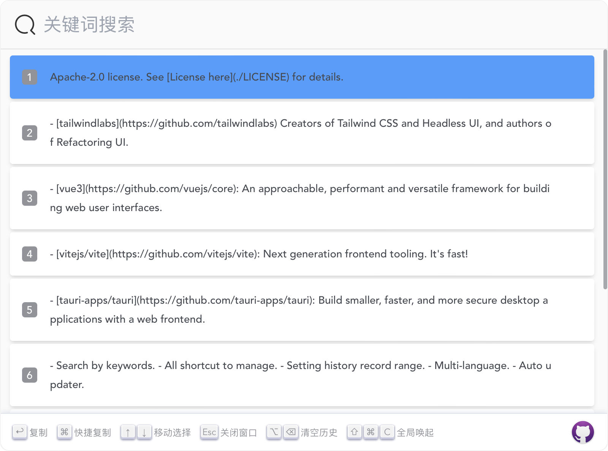
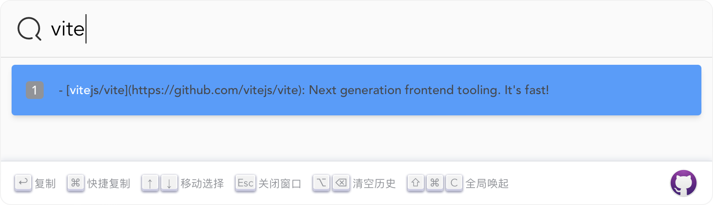

<h1 align="center">
  
  <br>
  Lanaya
  <br>
</h1>

<h3 align="center">
一个简洁易用的剪切板管理
</h3>

<h3 align="center">
<a href="https://github.com/ChurchTao/Lanaya/blob/master/README_EN.md">English</a> |
<a href="https://github.com/ChurchTao/Lanaya/blob/master/README_CN.md" target="_blank">中文</a>
</h3>

## 简介

`Lanaya` 来自于`DOTA2`中的圣堂刺客, 简洁易用，全键盘操作的剪切板管理工具

## 功能

- 通过关键词搜索
- 全快捷键操作
- 设置历史条数范围
- 多语言
- 自动更新

## 未完成

- [x] 新增设置页面，开放一些参数为设置首选项
- [ ] 增加主题
- [x] 引入`taildwind`管理 css
- [x] 整理代码结构
- [ ] 新增复制图片历史的功能
- [x] 引入多语言
- [x] 引入自动更新
- [ ] 新增收藏夹功能

## 下载

从 [release](https://github.com/ChurchTao/Lanaya/releases) 中下载.

## 开发

你需要安装 `Rust` 和 `Nodejs`，详细步骤查看 [这里](https://tauri.app/zh-cn/v1/guides/getting-started/prerequisites) ，然后按如下命令进行开发

```shell
npm install
```

然后

```shell
cargo install tauri-cli # 提示没有 cargo tauri 命令需先执行安装
cargo tauri dev
```

如果需要构建

```shell
cargo tauri build
```

## 截图

<div align="center">
  
  
  
</div>

## 建议

👏🏻 非常欢迎提`Issue`和`PR`！毕竟一个人的力量有限。

## 技术栈

`Lanaya` 基于如下技术栈：

- [tauri-apps/tauri](https://github.com/tauri-apps/tauri): Build smaller, faster, and more secure desktop applications with a web frontend.
- [vitejs/vite](https://github.com/vitejs/vite): Next generation frontend tooling. It's fast!
- [vue3](https://github.com/vuejs/core): An approachable, performant and versatile framework for building web user interfaces.
- [tailwindlabs](https://github.com/tailwindlabs) Creators of Tailwind CSS and Headless UI, and authors of Refactoring UI.

## License

Apache-2.0 license. See [License here](./LICENSE) for details.
