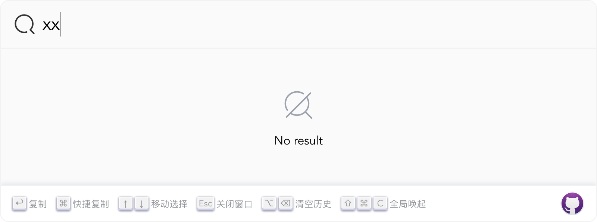

<h1 align="center">
  
  <br>
  Lanaya
  <br>
</h1>

<h3 align="center">
A clipboard management with easy to use.
</h3>

<h3 align="center">
<a href="https://github.com/ChurchTao/Lanaya/blob/master/README_EN.md">English</a> |
<a href="https://github.com/ChurchTao/Lanaya/blob/master/README_CN.md" target="_blank">中文</a>
</h3>

## Introduction

Lanaya comes from Templar Assassin in Dota2, which is a clipboard management software with convenient and simple interaction.

## Features

- Search by keywords.
- All shortcut to manage.

## Todos

- [ ] make some args to settings.
- [ ] light and black theme.
- [x] collect css by `taildwind`.
- [x] collect code.
- [ ] add image type history.
- [ ] multi-language
- [ ] updater

## Download

Download from [release](https://github.com/ChurchTao/Lanaya/releases).

## Development

You should install Rust and Nodejs, see [here](https://tauri.studio/docs/getting-started/prerequisites) for more details. Then install Nodejs packages.

```shell
npm install
```

Then run

```shell
cargo install tauri-cli # output with [no such subcommand: `tauri`] please install first 

cargo tauri dev
```

Or you can build it

```shell
cargo tauri build
```

## Screenshots

<div align="center">
  
  
  
</div>

## Contributions

Issue and PR welcome!

## Acknowledgement

Lanaya was based on or inspired by these projects and so on:

- [tauri-apps/tauri](https://github.com/tauri-apps/tauri): Build smaller, faster, and more secure desktop applications with a web frontend.
- [vitejs/vite](https://github.com/vitejs/vite): Next generation frontend tooling. It's fast!
- [vue3](https://github.com/vuejs/core): An approachable, performant and versatile framework for building web user interfaces.

## License

Apache-2.0 license. See [License here](./LICENSE) for details.
